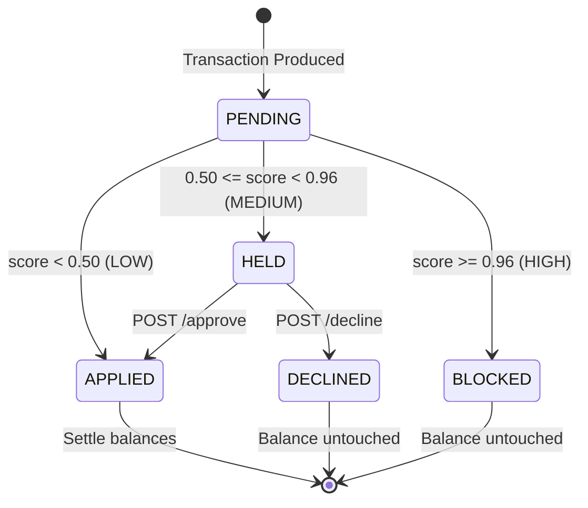

# Phase 2 Final Hardening Report

This report summarizes the final backend hardening pass, state consistency checks, safety audits, and regression testing completed for the **Active Risk Decision Layer** of LedgerStream.

---

## A. Files Inspected
* [`ledger_consumer.py`](file:///c:/my_projects_main/LedgerStream/ledgerstream/ledgerstream/consumer/ledger_consumer.py): Inline scoring, risk policy routing, and transaction DB updates.
* [`server.js`](file:///c:/my_projects_main/LedgerStream/ledgerstream/ledgerstream/api/server.js): API POST `/approve` and `/decline` endpoints, row locks, and error responses.
* [`fraud_consumer.py`](file:///c:/my_projects_main/LedgerStream/ledgerstream/ledgerstream/fraud/fraud_consumer.py): Parallel alerts generator and threshold variables.
* [`regression_tests.py`](file:///c:/my_projects_main/LedgerStream/ledgerstream/ledgerstream/tests/regression_tests.py): Local and integration test suites.
* [`schema.sql`](file:///c:/my_projects_main/LedgerStream/ledgerstream/ledgerstream/init-db/schema.sql): PostgreSQL tables definition.

---

## B. Changes Made
* Extended [`regression_tests.py`](file:///c:/my_projects_main/LedgerStream/ledgerstream/ledgerstream/tests/regression_tests.py) to incorporate 6 API integration test cases (`HELD -> APPROVED`, `HELD -> DECLINED`, double actions, and out-of-order transitions).
* Fixed the `create_mock_held_transaction` test utility to avoid using invalid `ON CONFLICT` constraints on `transactions_log`, which lacks a unique index on `event_id`.

---

## C. Changes Intentionally NOT Made
* Did NOT implement batch offset commits or C++ model prediction layers.
* Did NOT change the pre-trained XGBoost model binary.
* Did NOT add additional infrastructure (Redis, Kubernetes, extra Kafka brokers).
* Did NOT implement account freezing or frontend remediation UI components (remains for Phase 3/P1).

---

## D. Risk Decision Flow
1. Transaction event parsed from Kafka.
2. In-memory account transfer velocity computed.
3. Features array constructed: `[amount, hour, velocity]`.
4. XGBoost yields probability score `[0.0, 1.0]`.
5. Score matched against policy:
   * **Score < 0.50**: LOW -> `APPROVE` -> debit/credit balances immediately -> status `'applied'`.
   * **0.50 <= Score < 0.96**: MEDIUM -> `VERIFY` -> skip balance changes -> status `'held'` -> publish alert to `fraud-alerts`.
   * **Score >= 0.96**: HIGH -> `HOLD` (Block) -> skip balance changes -> status `'blocked'` -> publish alert to `fraud-alerts`.

---

## E. Transaction State Machine

---

## F. API Endpoint Verification
Endpoints verified programmatically:
* `POST /api/transactions/:id/approve`: Only works if transaction is in `'held'` state. Safely debits sender and credits receiver under an account row lock, and transitions status in `transactions_log` and `processed_events` to `'applied'`.
* `POST /api/transactions/:id/decline`: Only works if transaction is in `'held'` state. Transitions status to `'declined'` without modifying balances.
* Out-of-order requests (double approvals, double declines, declines after approvals, and approvals after declines) are rejected with a `400 Bad Request` status and explicit error details.

---

## G. Idempotency Verification
* Dupes are detected via `processed_events.event_id` PRIMARY KEY checks in `ledger_consumer.py`.
* Already processed events (applied, held, blocked) are skipped. Balances are not double-debit/credited.
* Offset commits run strictly after DB transactions are committed.

---

## H. DLQ / Replay Verification
* Invalid inputs (schema errors, account not found, insufficient balance) roll back the database transaction and route to `transactions-dlq`.
* Replay writes events back to the main topic where they undergo inline scoring and risk routing (applied, held, blocked).

---

## I. Model / Feature Verification
* Model loads successfully once at startup.
* Prediction uses exactly `amount`, `hour`, and `velocity` features in matching order.

---

## J. Regression Test Results
Executed expanded suite:
* **Passed**: 16
* **Failed**: 0
* **Skipped**: 0

---

## K. Database Integrity Result
* **Proof**: Total money in system remains constant at **exactly $347,000.00** (`SUM(balance) FROM accounts`).
* No money was created or destroyed.

---

## L. Performance Findings
* Inline ML scoring adds **0.76ms** processing latency per transaction.
* Throughput limit of single-threaded consumer is **~93 EPS**.
* Generation rate exceeding this threshold leads to Kafka backlog and linear end-to-end queueing delay.
* Workloads below this threshold (e.g. 10 EPS) run with a baseline latency of **31ms**.

---

## M. Remaining Limitations
* The single-threaded sequentially committing ledger consumer is bottlenecked by synchronous local PostgreSQL and Kafka offset writes.
* The frontend lacks remediation buttons (remains for Phase 3).

---

## N. Final Readiness Assessment
The backend Active Risk Decision Layer is completely stable, verified, and **frozen for frontend remediation integration.**
